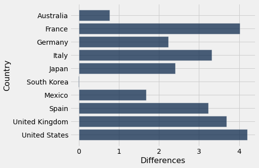
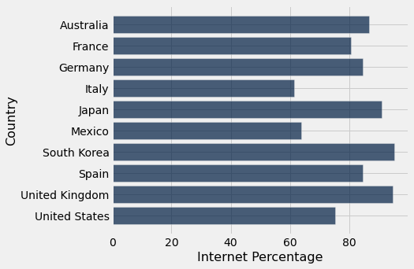

# Netflix Pricing 

## Synopsis
In economics, there’s a concept called purchasing power parity, in which there’s a theoretical exchange rate that allows you to buy the same amount of goods and services in every country.

## Why Netflix? 
Netflix is a streaming service that offers a wide variety of award-winning TV shows, movies, anime, documentaries, and more on thousands of internet-connected devices. It is one of the most popular streaming services today. It is available on a wide variety of countries and its subscription price ranges from country to country as well. Upon getting this data, we only selected the necessary columns. 

## Scraping Netflix Data From Source
On 'www.comparitech.com/blog/vpn-privacy/countries-netflix-cost/', there are a variety of data concerning netflix pricing across countries. For simplicity's sake, we choose the first table containing 12 random countries consisting of netflix prices with ads, one of those countries including Canada.

## Scraping GST Data From Source 
The website, 'https://taxsummaries.pwc.com/quick-charts/value-added-tax-vat-rates', consists of data involving VAT rated across countries. We will aggregate the VAT rates so that we could get a sense of the full price with taxes in each country. 

## Tidying Up GST Data
In order to combine our data, we had to have a common table for the join function to work. 

Thus, we had to change the way the column "Territory" is formatted in our gst table. It included when the country's vat was last reviewed. Purely for Analysis, we did not need that, so we had to get rid of it. We then relabeled "Territory" into "Country". From this, we created a temporary common column in both tables without any spaces between the country names so that it will be completely identical. 

## Joining Netflix Data with GST Data
As we join our netflix table with our gst table, the countries in our netflix table only remained because it is the only country that is in common with the gst table. We then dropped the temporary country column and kept the "Country" column from the netflic pricing table.  

## Tidying Our Combined Data 
After scraping, we needed to so some data cleaning for the data to be interpretable for analysis.   
1. We split Prices Local into prices and currency codes.
2. Dropped Brazil after some research as the VAT in the country is very complex.
3. Cleaned the 'Standard VAt rate %' column by getting rid of the words and converting what is left to a float type. 

## Price with VAT 
Our prices and VAT rates are now floats and are ready to work with. We multiplied each price with the corresponding VAT percentage as a decimal and added that value to the original price. In this way we get an idea of how much you will eventually pay. 

## Coverting Prices with VAT into Canadian Dollars 
We converted all the prices with VAT rates added using a conversion function we made. In this way all of the prices are all in the same units - Canadian Dollars. 

## The Differences 
Since all of the prices are now in the same units, we subtracted Canada's price with VAT from each of the countries. This is if you live in Canada, which country could you find the price for netflix the cheapest out of all the ones we have. 

 

As you can see South Korea is the only country that is in the negatives, meaning it is lower than Canada's price with taxes. The rest of the countries have prices higher than Canada. 

## External Factor - Internet Usage Per Country 
Since netflix heavily involves access to the internet, we choosed the percentage of internet usgae per country for out external factor. 

We gathered the csv file with this Data from 'https://www.kaggle.com/datasets/tanuprabhu/list-of-countries-by-number-of-internet-users'. 

Upon reading this table, we only selected the necessar columns for analysis. 

## Cleaning Internet Usage Per Country Data 
This data set also needed some cleaning so that we can interpret and analyze it. We cleaned the 'Percentage' column by getting rid of the % and other excess information. We then turned whatever we had left into a float. 
 

As you can see South korea has the highest internet usage at 95.1 and Italy has the lowest at 65.1. 

## Plotting the Correlation Between the Differences and Internet Usage Per Country

* Insert scatter plot 

From the scatterplot, there is a weak negative correlation between the differences and internet usage per country. This means generally, there is a slight trend that as the internet usage goes up, the price fof netflix goes down. However, this does not imply causation as there are confounding factors that might be present in each country. (look up a confounding factor) 
